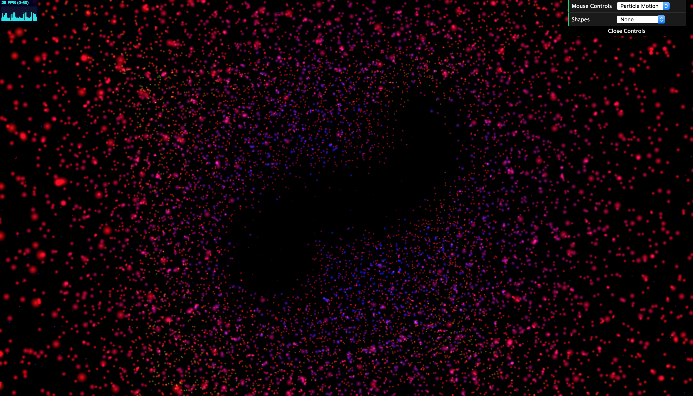

# Project 6: Particle System

Name: Alexis Ward

PennKey: aleward

Demo Link: [here](https://aleward.github.io/particle-system-aleward/)

# Interactions

## Mouse

Toggle between Camera and Particle Motion modes to use the mouse!

Camera Mode allows you to move your view, while Particle Motion Mode allows you to interact with the particles

### Use the left click to attract particles ...

### ... and the right click to repel.

## Meshes

Look within the Shapes menu to attract the particles to different forms. Some examples below:

